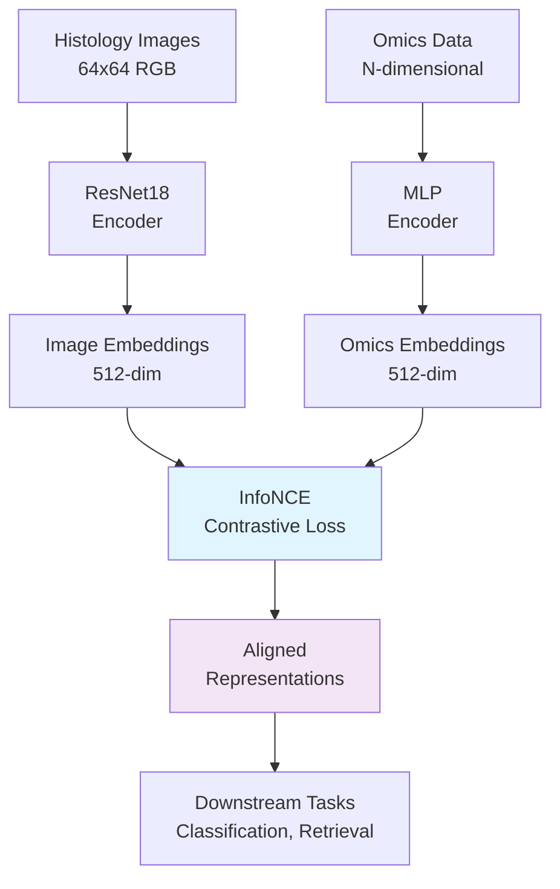

# Concepts

This page explains the core concepts, architecture, and methodology behind histo-omics-lite.

## Overview

Histo-omics-lite implements a **multimodal learning framework** for aligning histology images with omics data. The goal is to learn shared representations that enable cross-modal retrieval and improved downstream predictions.

## Architecture

### High-Level Pipeline



### Model Components

#### 1. Vision Encoder (ResNet18)

- **Input**: 64×64 RGB histology images
- **Architecture**: ResNet18 pretrained on ImageNet
- **Output**: 512-dimensional image embeddings
- **Purpose**: Extract visual features from tissue morphology

#### 2. Omics Encoder (MLP)

- **Input**: N-dimensional omics features (genes, proteins, etc.)
- **Architecture**: Multi-layer perceptron with ReLU activations
- **Output**: 512-dimensional omics embeddings  
- **Purpose**: Transform high-dimensional omics to shared embedding space

#### 3. Contrastive Learning (InfoNCE)

- **Method**: InfoNCE (Information Noise Contrastive Estimation)
- **Objective**: Maximize mutual information between paired modalities
- **Temperature**: Learnable parameter controlling contrastive sharpness
- **Negatives**: In-batch negative sampling for efficiency

## Learning Objectives

### Contrastive Learning

The core learning objective aligns image and omics representations using InfoNCE:

$$\mathcal{L} = -\log \frac{\exp(\text{sim}(z_i, z_o) / \tau)}{\sum_{j=1}^{N} \exp(\text{sim}(z_i, z_o^j) / \tau)}$$

Where:
- $z_i$: Image embedding
- $z_o$: Omics embedding  
- $\tau$: Temperature parameter
- $\text{sim}(·,·)$: Cosine similarity

### Model Variants

The framework supports multiple fusion strategies:

=== "CLIP Alignment"
    Pure contrastive learning between modalities
    ```python
    # Pseudocode
    img_emb = vision_encoder(images)
    omics_emb = omics_encoder(omics) 
    loss = infonce_loss(img_emb, omics_emb)
    ```

=== "Early Fusion"
    Concatenate features before classification
    ```python
    # Pseudocode
    img_features = vision_encoder(images)
    omics_features = omics_encoder(omics)
    combined = concat(img_features, omics_features)
    logits = classifier(combined)
    ```

=== "Late Fusion"
    Combine predictions from separate models
    ```python
    # Pseudocode
    img_logits = img_classifier(vision_encoder(images))
    omics_logits = omics_classifier(omics_encoder(omics))
    final_logits = α * img_logits + (1-α) * omics_logits
    ```

=== "Single Modality"
    Baseline models using only one modality
    ```python
    # Image-only
    logits = img_classifier(vision_encoder(images))
    
    # Omics-only  
    logits = omics_classifier(omics_encoder(omics))
    ```

## Data Pipeline

### Synthetic Dataset Generation

For reproducible benchmarking, we generate synthetic multimodal data:

```python
def generate_synthetic_sample(class_label, seed):
    # Generate correlated image and omics features
    if class_label == "malignant":
        # Higher intensity, specific patterns
        image = generate_malignant_texture(seed)
        omics = sample_malignant_profile(seed)
    else:
        # Lower intensity, different patterns  
        image = generate_benign_texture(seed)
        omics = sample_benign_profile(seed)
    
    return image, omics, class_label
```

### Data Characteristics

- **Images**: 64×64 RGB histology-like textures
- **Omics**: 30-50 dimensional feature vectors
- **Labels**: Binary classification (benign/malignant)  
- **Size**: 100 samples (configurable)
- **Splits**: 70% train, 15% val, 15% test

### Data Loading

```python
from histo_omics_lite.data.loader import HistoOmicsDataset

dataset = HistoOmicsDataset(
    image_root="data/synthetic/images",
    omics_csv="data/synthetic/omics.csv",
    transform=transforms.Compose([
        transforms.ToTensor(),
        transforms.Normalize(mean=[0.5, 0.5, 0.5], std=[0.5, 0.5, 0.5])
    ])
)
```

## Training Process

### Configuration Management

Training is configured via Hydra YAML files:

```yaml
# configs/train/fast_debug.yaml
seed: 42
temperature: 0.07
omics_input_dim: 50

data:
  root: data/synthetic
  batch_size: 16
  num_workers: 0

trainer:
  max_epochs: 1
  accelerator: cpu
  deterministic: true
```

### Training Loop

1. **Data Loading**: Batch loading of paired (image, omics, label) samples
2. **Forward Pass**: Encode both modalities to shared embedding space
3. **Loss Computation**: InfoNCE contrastive loss + optional classification loss
4. **Optimization**: Adam optimizer with configurable learning rate
5. **Validation**: Periodic evaluation on held-out validation set

### Monitoring

Training progress is tracked via:

- **MLflow**: Experiment tracking with metrics and artifacts
- **Lightning Logs**: Detailed training logs and checkpoints
- **TensorBoard**: Real-time visualization of training curves

## Evaluation Methodology

### Metrics

#### Classification Performance
- **AUROC**: Area under ROC curve
- **AUPRC**: Area under precision-recall curve
- **Top-k Accuracy**: For retrieval tasks

#### Calibration
- **ECE**: Expected Calibration Error
- **Reliability Curves**: Confidence vs accuracy plots
- **Brier Score**: Probabilistic calibration measure

#### Retrieval Performance  
- **Cross-Modal Retrieval**: Image→omics and omics→image search
- **Top-1/5/10 Accuracy**: Retrieval accuracy at different cutoffs
- **Mean Reciprocal Rank**: Ranking quality metric

### Statistical Rigor

#### Bootstrap Confidence Intervals

```python
from histo_omics_lite.evaluation import bootstrap_confidence_intervals

# Compute 95% CIs from 1000 bootstrap samples
results = bootstrap_confidence_intervals(
    y_true, y_pred, 
    n_bootstrap=1000,
    confidence_level=0.95
)

print(f"AUROC: {results['auroc']['point_estimate']:.3f} "
      f"({results['auroc']['lower_ci']:.3f}-{results['auroc']['upper_ci']:.3f})")
```

#### Multiple Runs
- Results averaged across multiple random seeds
- Statistical significance testing when comparing models
- Effect size reporting (Cohen's d)

### Visualization

#### UMAP Embeddings
```python
from histo_omics_lite.visualization import plot_umap_embeddings

plot_umap_embeddings(
    image_embeddings, omics_embeddings, labels,
    save_path="artifacts/umap_plot.png"
)
```

#### Grad-CAM Attention
```python
from histo_omics_lite.visualization import generate_gradcam

attention_maps = generate_gradcam(
    model, images, target_class=1
)
```

## Design Principles

### Reproducibility
- **Deterministic execution** with fixed random seeds
- **Version pinning** for all dependencies  
- **Containerization** with Docker for environment isolation
- **Golden tests** for regression detection

### Efficiency
- **CPU-first design** for accessibility
- **Lightweight models** (ResNet18, small MLPs)
- **Fast training** (<5 minutes end-to-end)
- **Minimal dependencies** for easy deployment

### Modularity
- **Pluggable components** (encoders, fusion strategies, losses)
- **Configurable pipelines** via Hydra
- **Extensible evaluation** metrics and visualizations
- **Clean APIs** for integration

### Quality
- **Comprehensive testing** with >90% coverage
- **Type safety** with MyPy strict mode
- **Code quality** with Ruff formatting and linting  
- **Documentation** with executable examples

## Use Cases

### Research Applications
- **Multimodal learning** research and prototyping
- **Benchmarking** new fusion architectures
- **Ablation studies** on contrastive learning
- **Educational** demonstrations of CLIP-style training

### Production Considerations
- **CPU deployment** for resource-constrained environments
- **Fast inference** for real-time applications
- **Model interpretability** via attention visualization
- **Uncertainty quantification** via calibration

## Limitations

### Current Constraints
- **Synthetic data** only (no real clinical datasets)
- **Binary classification** (easily extensible to multi-class)
- **Small scale** (100 samples for demo purposes)
- **CPU-only training** (GPU support available but not required)

### Future Extensions
- **Real dataset adapters** for clinical data
- **Multi-class/regression** tasks
- **Larger scale** experiments (1K+ samples)
- **Advanced architectures** (Vision Transformers, etc.)
- **Federated learning** for privacy-preserving training