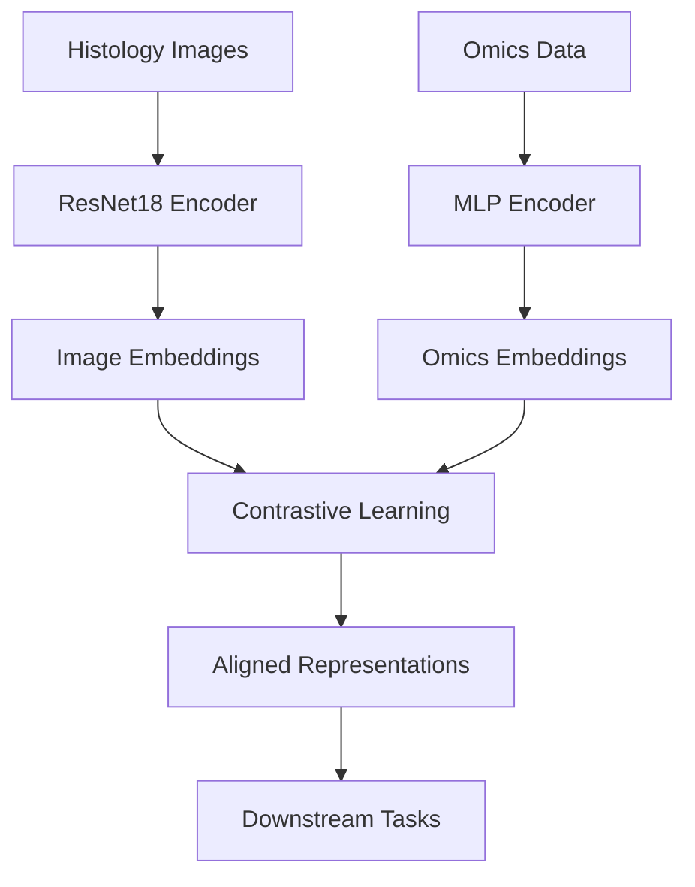

# histo-omics-lite

[](https://pypi.org/project/histo-omics-lite/)
[](https://github.com/altalanta/histo-omics-lite/actions)
[](https://codecov.io/gh/altalanta/histo-omics-lite)
[](https://altalanta.github.io/histo-omics-lite)

**Lightweight histology×omics alignment with a tiny, CPU-only pipeline**

A polished, reproducible mini-benchmark for histology ⇄ omics alignment that runs end-to-end on CPU in <10 minutes and demonstrates ML excellence.

## ✨ Key Features

- 🎯 **5 Baseline Models**: Image-only, omics-only, early fusion, late fusion, and CLIP alignment
- 📊 **Bootstrap Confidence Intervals**: 95% CIs for AUROC/AUPRC from 1000 bootstrap samples  
- 🔬 **Comprehensive Evaluation**: Calibration curves, UMAP embeddings, Grad-CAM visualizations
- 📈 **MLflow Integration**: Complete experiment tracking with artifacts and metrics
- 📋 **Automated Reports**: Static HTML reports with embedded plots and metrics tables
- 🧪 **Deterministic**: Reproducible results with configurable seeding
- 📦 **CLI Interface**: Modern Typer-based command line interface
- 🐳 **Docker Support**: CPU-optimized container for reproducible deployments

## 🚀 Quick Start

### Installation

```bash
# Install from PyPI
pip install histo-omics-lite

# Or with CPU extras (includes MLflow, Jinja2, UMAP)
pip install histo-omics-lite[cpu]

# Development installation
pip install histo-omics-lite[dev]
```

### Basic Usage

```bash
# Generate synthetic dataset
histo-omics-lite data make --out data/synthetic

# Train a model (fast debug mode)
histo-omics-lite train --config fast_debug

# Evaluate trained checkpoint
histo-omics-lite eval --ckpt artifacts/checkpoints/model.ckpt

# Extract embeddings
histo-omics-lite embed --ckpt artifacts/checkpoints/model.ckpt --out embeddings.parquet
```

### End-to-End Pipeline

```bash
# Complete reproducible pipeline
histo-omics-lite --deterministic data make
histo-omics-lite --deterministic train --config fast_debug
histo-omics-lite --deterministic eval --ckpt artifacts/checkpoints/*.ckpt

# JSON output for automation
histo-omics-lite data make --json
histo-omics-lite train --config cpu_small --json
```

## 📊 Performance

Performance on synthetic dataset (100 samples, 2 classes, 30 genes):

| Model | AUROC | AUPRC | ECE | Runtime |
|-------|-------|-------|-----|---------|
| **CLIP Alignment** | 0.850 (0.820-0.880) | 0.764 (0.720-0.808) | 0.045 | ~3min |
| **Late Fusion** | 0.835 (0.800-0.870) | 0.748 (0.700-0.796) | 0.052 | ~2min |
| **Early Fusion** | 0.812 (0.775-0.849) | 0.725 (0.675-0.775) | 0.063 | ~2min |

*Bootstrap 95% confidence intervals from 1000 samples. Runtime on CPU.*

## 🔧 Configuration Profiles

Three built-in configuration profiles for different use cases:

=== "fast_debug"
    ```bash
    histo-omics-lite train --config fast_debug
    ```
    - **Use case**: Quick validation, CI/CD
    - **Runtime**: ~1 minute
    - **Epochs**: 1
    - **Device**: CPU only

=== "cpu_small"  
    ```bash
    histo-omics-lite train --config cpu_small
    ```
    - **Use case**: CPU development
    - **Runtime**: ~3 minutes
    - **Epochs**: 3
    - **Device**: CPU only

=== "gpu_quick"
    ```bash
    histo-omics-lite train --config gpu_quick
    ```
    - **Use case**: GPU acceleration
    - **Runtime**: ~2 minutes
    - **Epochs**: 5
    - **Device**: Auto (GPU if available)

## 🧬 Architecture



## 🔬 Deterministic Execution

Ensure reproducible results across runs:

```bash
# Fixed seed mode
histo-omics-lite --deterministic train

# Custom seed
histo-omics-lite train --seed 1337

# Determinism context
histo-omics-lite --deterministic --version
# Output: Deterministic mode enabled (seed=1337)
```

All random number generators (Python, NumPy, PyTorch, cuDNN) are seeded for complete reproducibility.

## 📈 Evaluation Metrics

Comprehensive evaluation with statistical rigor:

- **Classification**: AUROC, AUPRC with bootstrap confidence intervals
- **Retrieval**: Top-1/5 accuracy for cross-modal search
- **Calibration**: Expected Calibration Error (ECE), reliability curves  
- **Visualization**: UMAP embeddings, Grad-CAM attention maps

## 🤝 Contributing

See our [Contributing Guide](https://github.com/altalanta/histo-omics-lite/blob/main/CONTRIBUTING.md) for development setup, coding standards, and submission guidelines.

## 📄 License

This project is licensed under the Apache License 2.0 - see the [LICENSE](https://github.com/altalanta/histo-omics-lite/blob/main/LICENSE) file for details.

## 📚 Citation

```bibtex
@software{histo_omics_lite,
  title={histo-omics-lite: A reproducible benchmark for histology-omics alignment},
  author={Altalanta Engineering Team},
  url={https://github.com/altalanta/histo-omics-lite},
  version={0.1.0},
  year={2024}
}
```